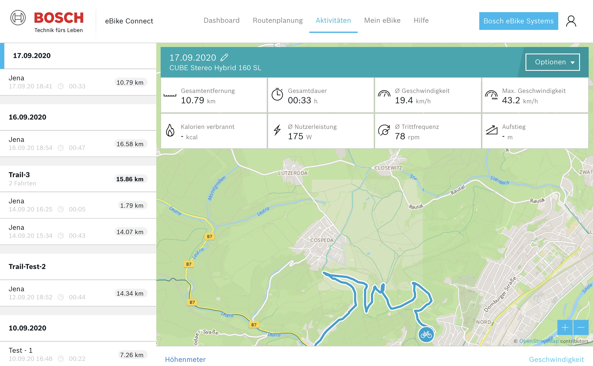
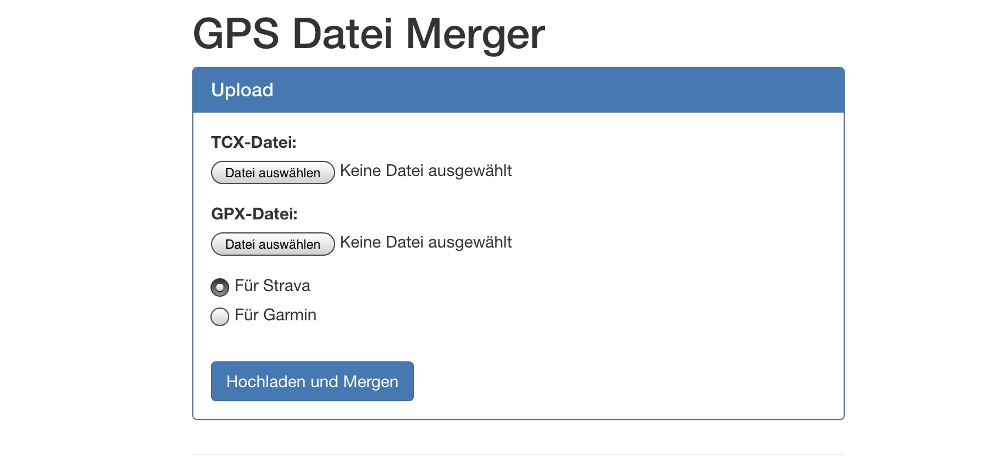

# Trackmerger

This tool merges TCX or GPX files from Apple Watch and TCX files from Bosch E-Bike Connect into one file to upload to Strava, Garmin etc.

You can choose which values of each file should be merged.

---

## How to use

#### Bosch e-bike Connect (export tcx from your bike ride)

1. Go to [Bosch e-Bike Connect](https://www.ebike-connect.com/login?lang=de-de) and Login.
2. Go to "Activity" and select the activity you want to export.
3. Click on options and select export as „TCX“
4. Save this file on your computer.

#### Apple Watch (export gpx or tcx file from your training)

1. You need a app installed on your iphone which makes it possible to export a apple watch training as GPX.
(You can use the app "Rungap" or any other wich can export your trainings to do that.)
2. Export your training and save the file.

#### Merge both files
1. Upload both files and select type of export.
2. Merge it

---

## How to run in docker

1. Pull image from dockerhub and run container

        docker run -d trackmerger/trackmerger:latest

2. Open your browser and navigate to http://localhost:80

## How to run with docker-compose

1. Download docker-compose.yml.sample from repository

2. Rename "docker-compose.yml.sample" into "docker-compose.yml"

        cp docker-compose.yml.sample docker-compose.yml
        
3. Start container with docker-compose

        docker-compose up -d

---

## Run in docker - development

1. Clone repository
2. Rename "docker-compose.yml.sample.dev" into "docker-compose.yml"
3. Change parameters like port if you want (default port is 80)

        version: '2'

        services:
            app:
               image: richarvey/nginx-php-fpm:1.10.3
               container_name: gps_merger
               restart: always
               volumes:
                  - .:/var/www/html
                  - ./docker/nginx/default.conf:/etc/nginx/sites-enabled/default.conf
               ports:
                  - 127.0.0.1:8787:80
               environment:
                  - WEBROOT=/var/www/html/public

4. Rename "env.example" to ".env"

        mv .env.example .env

5. Start container with docker-compose

        docker-compose up -d

6. Enter container and run following 2 commands for setup

        docker exec -it trackmerger bash
            composer install
            php artisan key:generate

7. Open your browser and navigate to http://localhost:80

 :exclamation: Change .env parameters to following if you use it in production:

        APP_ENV=production
        APP_DEBUG=false
        APP_URL=http://localhost (fill in your needs)

---

## How to build docker image

    docker build -t yourname/trackmerger:1 .

### Run your image

    docker run -d yourname/trackmerger:1

### Run your image with docker-compose

    version: '2'

    services:
       app:
          image: yourname/trackmerger:1
          container_name: trackmerger
          restart: always
          environment:
             - WEBROOT=/var/www/html/public

